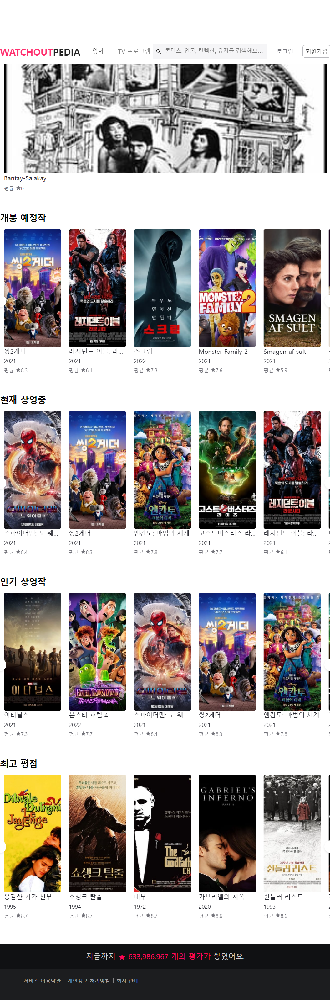

# watchout-pedia-react

## 개발목적

-   클론코딩
-   의견추가(Api,design,component,로그인)

## 개발환경

-   React
-   Typescript
-   jest
-   emotion
-   mui material

### 영화[API](https://www.themoviedb.org/)

 
 
 
 

### 프로젝트 이미지

